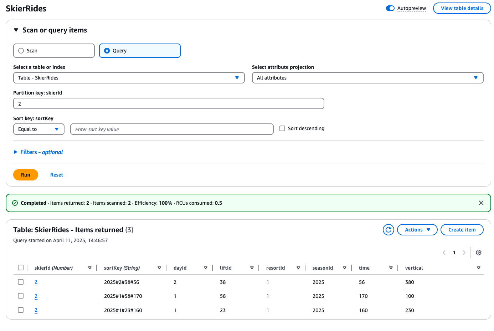
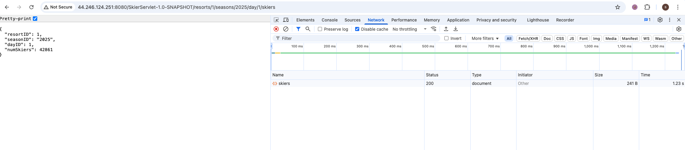
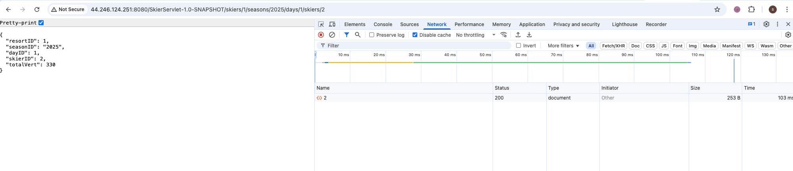
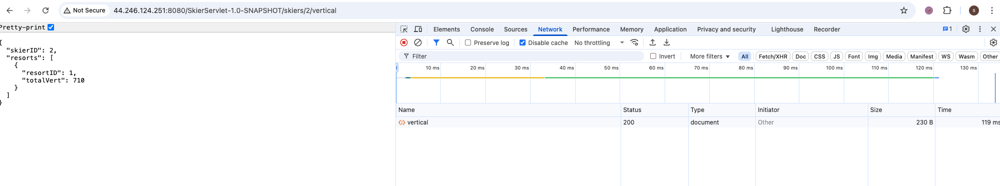

# CS6650-Assignment4
# DynamoDB Design for Skier Ride Data Processing

## Database Selection Rationale

After evaluating several database options (Redis, MySQL/RDS, DynamoDB, MongoDB), we selected **DynamoDB** for the following reasons:

- **Write Throughput**: Superior performance for high-volume write operations (crucial for our message processing)
- **Scalability**: Ability to handle massive throughput without complex sharding strategies
- **GSI Support**: Built-in indexing for efficient query access patterns without write locks
- **Managed Service**: No operational overhead for scaling, replication, or failover
- **Integration**: Native AWS integration with our EC2-based consumer architecture

## Database Design Overview
# SkierRides Table - DynamoDB Schema

## Overview

The `SkierRides` table stores information about individual lift rides taken by skiers at ski resorts. Each entry records who rode a lift, when and where they did it, and how much vertical distance they covered.

---

## Primary Table: `SkierRides`

### Key Schema

- **Partition Key:** `skierId` (Number)  
- **Sort Key:** `sortKey` (String)  
  - Format: `seasonId#dayId#liftId#time`  
  - Example: `"2022#34#7#157832"`  

### Attributes

| Attribute   | Type     | Description                                                  |
|-------------|----------|--------------------------------------------------------------|
| `skierId`   | Number   | Unique identifier for a skier                                |
| `sortKey`   | String   | Composite key in the format: `seasonId#dayId#liftId#time`    |
| `resortId`  | Number   | ID of the resort where the lift ride took place              |
| `seasonId`  | String   | Season identifier (e.g., `"2025"`)                           |
| `dayId`     | Number   | Day number within the ski season                             |
| `liftId`    | Number   | Identifier for the ski lift used                             |
| `time`      | Number   | Timestamp (or time of day) of the lift ride                  |
| `vertical`  | Number   | Vertical distance traveled in the ride (calculated as `liftId × 10`) |

---

## Global Secondary Indexes (GSIs)

### 1. `resort-day-index`

- **Purpose:** Query skiers who visited a specific resort on a given day.
- **Partition Key:** `resortId` (Number)
- **Sort Key:** `dayId` (Number)
- **Projected Attributes:** `skierId`, `seasonId`

### 2. `skier-day-index`

- **Purpose:** Query lift rides for a skier on a specific day.
- **Partition Key:** `skierId` (Number)
- **Sort Key:** `dayId` (Number)
- **Projected Attributes:** `vertical`, `liftId`, `resortId`, `seasonId`

---

## Sample Item

```json
{
  "skierId": 101,
  "sortKey": "2022#34#7#157832",
  "resortId": 1,
  "seasonId": "2025",
  "dayId": 1,
  "liftId": 7,
  "time": 157832,
  "vertical": 70
}
```

## Deployment Topology

### Compute Resources
- **Consumer Application**: Java application running on EC2
  - Instance Type: c3.large
  - Role: Consumes messages from RabbitMQ, processes data, writes to DynamoDB
  - Concurrency: 256 threads, 50 prefetch count per thread

### Database Provisioning
- **DynamoDB Table**: Provisioned capacity mode
  - Base Table: 50 RCU, 5000 WCU
  - GSIs: 20 RCU, 2000 WCU each
  - Region: US-West-2 (Oregon)

### Message Queue
- **RabbitMQ**: Deployed on EC2
  - Instance Type: t2.micro
  - Configuration: Persistent queues, durable messages

## Performance Optimization

- **Batch Writing**: Implemented custom batching with 25 items per batch
- **Write Efficiency**: Combined flush interval of 100ms with maximum batch size
- **GSI Scaling**: Matched GSI write capacity to base table (2000 WCU)
- **HTTP Client Tuning**: MaxConcurrency=250, ConnectionTimeout=5s

## Test API
### API Usage
**GET/resorts/{resortID}/seasons/{seasonID}/day/{dayID}/skiers**
get number of unique skiers at resort/season/day
```bash
http://[your-server-address]:8080/SkierServlet-1.0-SNAPSHOT/resorts/1/seasons/2025/day/1/skiers

http://44.246.124.251:8080/SkierServlet-1.0-SNAPSHOT/resorts/1/seasons/2025/day/1/skiers
or
curl -X GET "http://44.246.124.251:8080/SkierServlet-1.0-SNAPSHOT/resorts/1/seasons/2025/day/1/skiers" -H "Accept: application/json"

```

**GET/skiers/{resortID}/seasons/{seasonID}/days/{dayID}/skiers/{skierID}**
get the total vertical for the skier for the specified ski day
```bash
http://[your-server-address]:8080/SkierServlet-1.0-SNAPSHOT/skiers/1/seasons/2025/days/1/skiers/2

http://44.246.124.251:8080/SkierServlet-1.0-SNAPSHOT/skiers/1/seasons/2025/days/1/skiers/2
```

**GET/skiers/{skierID}/vertical**
get the total vertical for the skier the specified resort. If no season is specified, return all seasons
```bash
http://[your-server-address]:8080/SkierServlet-1.0-SNAPSHOT/skiers/2/vertical
http://44.246.124.251:8080/SkierServlet-1.0-SNAPSHOT/skiers/2/vertical
```
### Screenshot





## Deployment instruction
### Download Tomcat on Server (AMZ Linux 2023 t3.medium)
### Redis Config
#### Amazon Linux 2023 Initial Setup
```bash
bash# Update the system
sudo dnf update -y
```

#### Redis Installation 
```bash
bash# Install Redis
sudo dnf install redis6 -y

#Start Redis and enable on boot
sudo systemctl start redis6
sudo systemctl enable redis6

#Verify Redis is running
sudo systemctl status redis6
```

#### Redis Configuration
Edit the Redis configuration file:
```bash
bashsudo nano /etc/redis6.conf
```
Add or modify the following settings based on your instance type:
For t3.medium (4GB RAM):
```bash
#Memory configuration
maxmemory 2gb
maxmemory-policy allkeys-lru

#Performance settings
save ""
appendonly no
bind 127.0.0.1
tcp-backlog 511
io-threads 2
timeout 300
tcp-keepalive 60

#Logging (reduce disk I/O)
loglevel notice
logfile ""

# After making changes, restart Redis:
bashsudo systemctl restart redis6

# Verify your configuration:
bashredis6-cli config get maxmemory
redis6-cli config get maxmemory-policy
```

### Deploy Servlet on Server EC2
```bash
sudo scp -i 【yourpem】.pem SkierServlet-1.0-SNAPSHOT.war ec2-user@【ec2 public IP】:/usr/share/tomcat/webapps
```

### Deploy SkierConsumer on Consumer EC2
```bash
sudo scp -i 【yourpem】.pem Consumer-1.0-SNAPSHOT.jar ec2-user@【ec2 public IP】:~/
```
On Consumer EC2 run:
```bash
java -jar Consumer-1.0-SNAPSHOT.jar
```
wait for "create dynamodb table success", then run your client to make post requests. Make sure Server, RabbitMQ, Consumer EC2 are all running. 

```
